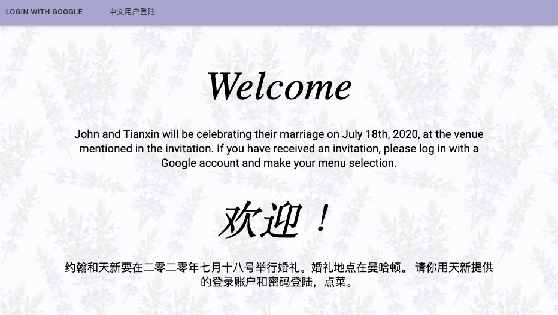
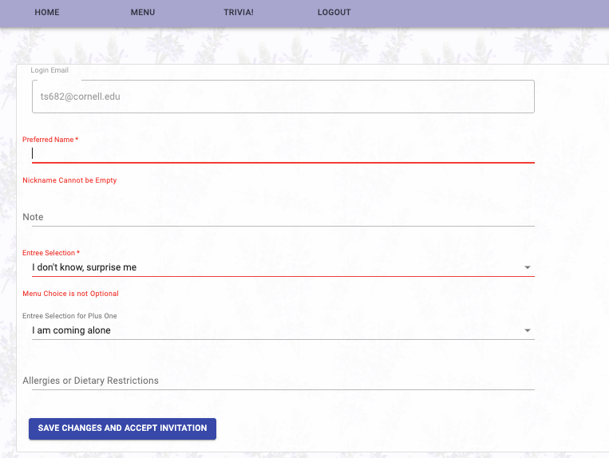
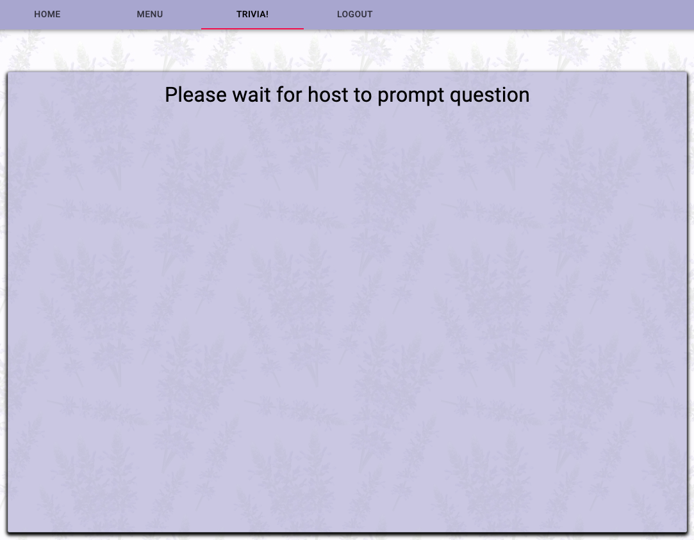
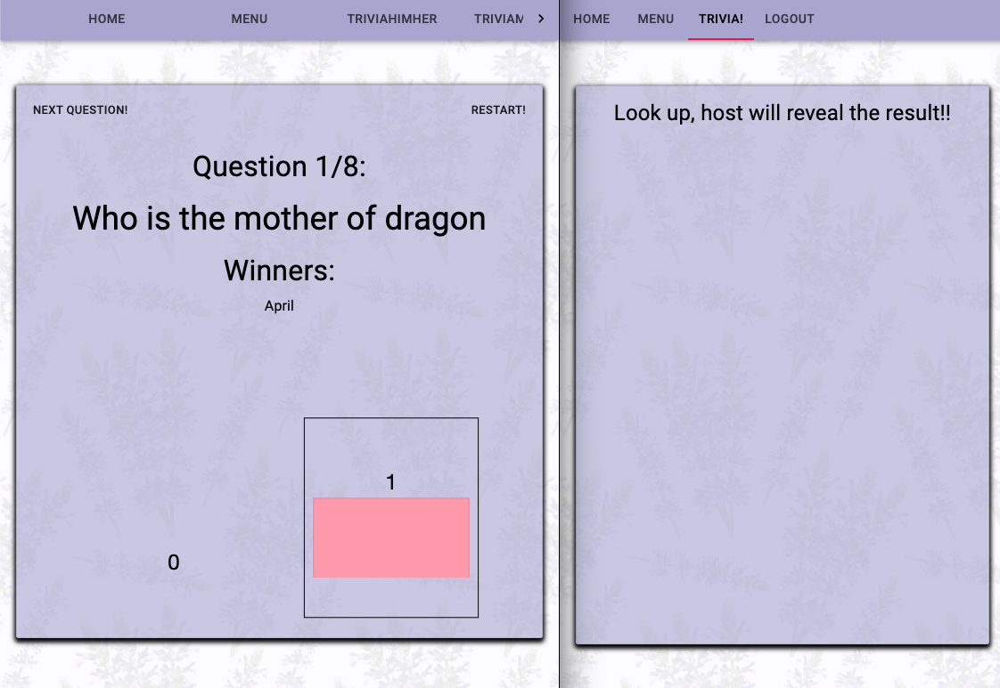

# Summary

Trivia with Us is an interactive tool for parties and events. The developer Tianxin is a newly wed and developed this tool for her own wedding reception.

## Invitation

The host will use the app to send out the invitations via email. We use hogan express to compile emails from template, and nodemailer to dispatch emails.

The invitation emails will direct guests to the website https://triviawithus.herokuapp.com/. The website welcomes guests with the page shown below:

<p align="center">
  
</p>

## RSVP

Guests can login with their google accounts. After logging in, they will be directed to their home page. They are prompted to update their nicknames. Nicknames will later be shown on the big screen when playing trivia, so it is not optional. Menu selection is the other mandatory field. Once guests made their menu selections and fill in their nicknames, they can click the button "save changes and accept invitation". After the button is clicked the app will automatically generate and send confirmation emails.

<p align="center">
  
</p>

## Wait for it

if guests try to visit the "TRIVIA!" tab before the host starts the game, the app will kindly ask them to wait for host.

<p align="center">
  
</p>

## Trivia time

Host (host's page is shown on the below page on the left) will run through a list of trivia questions, and guests (guest page is shown on the below page on the right) will be prompted to make their answer on their phone. As guests(voters) make their selections, their names will be shown on the host's page, which can be projected onto a big screen where anyone can easily see.

Note that even thought host and guest see very similar interfaces, they get questions from completely different sources. The host have access to the questions list in the database at all time, whereas guest can only get the one question that is currently being shown by the host. The question is send from the host via socket. Guests do not have access to the questions in the database.

<p align="center">
  
</p>

After each question, host will reveal the correct answer and the votes' statistic, the winners' (voters who made the correct answers) names will be shown on the host's big screen. Guests will be kindly asked to look away from their phones and to look at the host's big screen.

<p align="center">
  
</p>

After all questions are played, host will show the overall winner/winners.

<p align="center">
  
</p>

# Running the tool

If you want to play with this project on your computer, please complete these steps:

- Fork and clone this repo

```
git clone https://github.com/tianxinAngland/triviawithus/
```

- Run the below command to install required packages

```
npm install
```

- Create database and seed dummy data

```
createdb triviawithus
npm run seed
```

- Start app

```
npm run start-dev
```

- visit app on http://localhost:8080/

- You can also visit the deployed app at https://triviawithus.herokuapp.com/

# Testing

## Seeding real data

- Edit file /script/seedQuesions.js to add fun questions to the app
- Run the below command and seed the tool with fun questions!

```
npm run seed-questions
```

## Sending invitation

- Be careful to only send each guest one invitation!!
- Edit mailing list in script/InvitationPublic.js and rename the file as Invitation.js
- Edit the email template in public/Invitation.html
- Run the below command to send out invitation

```
npm run invitation
```

## Heroku PGBackups

To prevent loosing guest's information, such as menu choice, we recommend running heroku database backup periodically.

- Creating a backup

```
heroku pg:backups:capture --app triviawithus
```

- Checking backup status and find out versions of the backups

```
heroku pg:backups --app triviawithus
heroku pg:backups:info [b101] --app triviawithus
```

- Restoring backups

```
heroku pg:backups:restore [b101] DATABASE_URL --app triviawithus
```

More info here https://devcenter.heroku.com/articles/heroku-postgres-backups#creating-a-backup

# Technologies

## Nodemailer

https://nodemailer.com/about/

## Hogan Express

https://www.npmjs.com/package/hogan-express

## Socket.io

https://socket.io/
