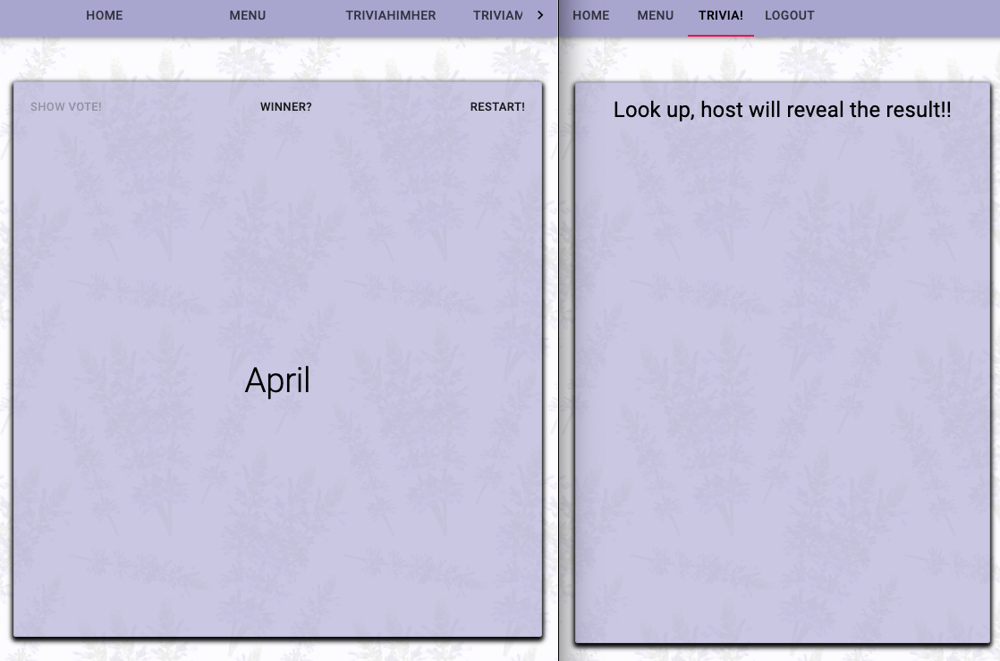

# Summary

Trivia with Us is an interactive tool for parties and events. The developer Tianxin is a newly wed and developed this tool for her own wedding reception.

## Invitation

The host will use the app to send out the invitations via email. We use hogan express to compile email from template, and nodemailer to send the emails.

The invitation email will direct guests to the website https://triviawithus.herokuapp.com/. The website welcomes guests with the below message:

<p align="center">
  
</p>

## RSVP - before the event

Guests can login with their google account, update their nickname (nickname will later be shown on the big screen when playing trivia), view menu, make menu selection and update other information such us dietary restrictions. Once guest made their menu selection and put in their nickname, they can confirm their RSVP. The app will send them a confirmation email.

<p align="center">
  
</p>

## Trivia - at the event

if guests try to visit the "trivia" tab, they would be told to wait for host.

<p align="center">
  
</p>

Host (host's page is shown on the below page on the left) will run through a list of trivia questions, and guests (guest page is shown on the below page on the right) will be prompted to make their answer on their phone. The votes' name will be shown on the host's big screen.

Even thought host and guest see very similar interface, they get the question from completely different sources. The host have access to the questions list from database at all time, whereas guest can only get the one question that is currently being played. The one questions is send from the host via socket.

<p align="center">
  
</p>

After each questions, host will show the correct answer and the votes' statistic, the winners' (voters for made the correct answer) name will be shown on the host's big screen. Guests (shown on the below page on the right) will be prompted to look at the host's big screen.

<p align="center">
  
</p>

After all questions are played, host will show the overall winners.

<p align="center">
  
</p>

# Running the tool

To test ot this project on your computer, please complete these steps:

- Fork and clone this repo

```
git clone https://github.com/tianxinAngland/triviawithus/
```

- Run the below command to install required packages

```
npm install
```

- Create database and seed dummy data

```
createdb triviawithus
npm run seed
```

- Start app

```
npm run start-dev
```

- visit app on http://localhost:8080/

- You can also visit the deployed app at https://triviawithus.herokuapp.com/

# Testing

## Seeding real data

- Edit file /script/seedQuesions.js to add fun questions to the app
- Run the below command and seed the tool with fun questions!

```
npm run seed-questions
```

## Sending invitation

- Be careful to only run it once!!
- Edit mailing list in script/InvitationPublic.js and rename the file as Invitation.js
- Edit the email template in public/Invitation.html
- Run the below command to send out invitation

```
npm run invitation
```

## Heroku PGBackups

To prevent loosing guest's information, such as menu choice, we recommend running heroku database backup periodically.

- Creating a backup

```
heroku pg:backups:capture --app triviawithus
```

- Checking backup status and find out versions of the backups

```
heroku pg:backups --app triviawithus
heroku pg:backups:info [b101] --app triviawithus
```

- Restoring backups

```
heroku pg:backups:restore [b101] DATABASE_URL --app triviawithus
```

More info here https://devcenter.heroku.com/articles/heroku-postgres-backups#creating-a-backup

# Technologies

## Nodemailer

https://nodemailer.com/about/

## Hogan Express

https://www.npmjs.com/package/hogan-express
